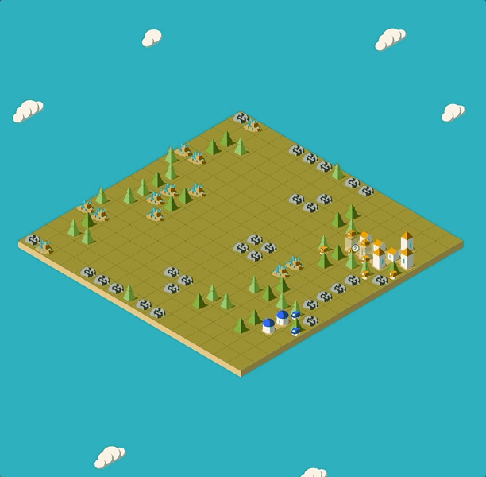

# Lux AI Challenge: Season 1

The night is dark and full of terrors. Two teams must fight off the darkness, collect resources, and advance through the ages. Daytime finds a desperate rush to gather and build the resources that can carry you through the impending night. Plan and expand carefully -- any city that fails to produce enough light will be consumed by darkness.

Welcome to the Lux AI Challenge Season 1!

The Lux AI Challenge is a competition where competitors design agents to tackle a multi-variable optimization, resource gathering, and allocation problem in a 1v1 scenario against other competitors. In addition to optimization, successful agents must be capable of analyzing their opponents and developing appropriate policies to get the upper hand.

Make sure to join our community discord at https://discord.gg/aWJt3UAcgn to chat, strategize, and learn with other competitors! We will be posting announcements on the Kaggle Forums and on the discord.

This was built by the Lux AI Challenge team, using the [Dimensions](https://github.com/StoneT2000/Dimensions) package.

Season 1 specifications can be found here: https://lux-ai.org/specs-2021

Bot API Documentation: https://github.com/Lux-AI-Challenge/Lux-Design-2021/tree/master/kits

Competition Leaderboard: Not yet released

The visualizer for the competition is at https://2021vis.lux-ai.org/. To get a local copy of the visualizer, see https://github.com/Lux-AI-Challenge/LuxViewer2021. You may also use the embedded visualizer on the Kaggle competition page.



## Getting Started

You will need Node.js version 12 or above. See installation instructions [here](https://nodejs.org/en/download/), you can just download the recommended version.

Open up the command line, and install the competition design with

```
npm install -g @lux-ai/2021-challenge@1.2.2
```

You may ignore any warnings that show up, those are harmless. To run a match from the command line (CLI), simply run

```
lux-ai-2021 path/to/botfile path/to/otherbotfile
```

and the match will run with some logging and store error logs and a replay in a new `errorlogs` folder and `replays` folder

For a full list of commands from the CLI, run

```
lux-ai-2021 --help
```

or go to the [next section](#CLI-Usage) to see more instructions on how to use the command line tool.

The [kits](https://github.com/Lux-AI-Challenge/Lux-Design-2021/tree/master/kits) folder in this repository holds all of the available starter kits you can use to start competing and building an AI agent and show you how to get started with your language of choice and run a match with that bot. You can also follow the following direct links

- Python: https://github.com/Lux-AI-Challenge/Lux-Design-2021/tree/master/kits/python
- Javascript: https://github.com/Lux-AI-Challenge/Lux-Design-2021/tree/master/kits/js
- C++: https://github.com/Lux-AI-Challenge/Lux-Design-2021/tree/master/kits/cpp
- Java: https://github.com/Lux-AI-Challenge/Lux-Design-2021/tree/master/kits/java

To stay up to date on changes and updates to the competition and the engine, see https://github.com/Lux-AI-Challenge/Lux-Design-2021/blob/master/ChangeLog.md or watch for announcements on the [forums](https://www.kaggle.com/c/hungry-geese/discussion) or the [Discord](https://discord.com/invite/DZSm47VHMz)

## CLI Usage

The CLI tool has several options. For example, one option is the seed and to set a seed of 100 simply run

```
lux-ai-2021 --seed=100 path/to/botfile path/to/otherbotfile
```

which will run a match using seed 100.

You can tell the CLI tool whether to store the agent logs or match replays via `--storeLogs, --storeReplay`. Set these boolean options like so

```
# to set to true
lux-ai-2021 --statefulReplay
# to set to false
lux-ai-2021 --storeLogs=false
```

By default the tool will generate minimum, **action-based**, replays that are small in size and work in the visualizer but it does not have state information e.g. resources on the map in each turn. To generate **stateful** replays, set the `--statefulReplay` option to true. To convert a action-based replay to a stateful one, set the `--convertToStateful` option to true and pass the file to convert.

Choose where the replay file is stored at by setting `--out=path/to/file.json`

You can also change the logging levels by setting `--loglevel=x` for number x from 0 to 4. The default is 2 which will print to terminal all game warnings and errors.

## Contributing

See the [guide on contributing](https://github.com/Lux-AI-Challenge/Lux-Design-2021/tree/master/CONTRIBUTING.md)

## Authors

Original design for season 1 concevied by [Bovard](https://github.com/bovard) and [Stone](https://github.com/StoneT2000)

UI/UX Design by [Isa](https://github.com/p-isa)

With balance testing help from [David](https://github.com/holypegasus)

## Sponsors
We would like to thank our 3 sponsors, [QuantCo](https://quantco.com/), [J Ventures](http://www.thejiangmen.com/), and qAImera this year for allowing us to provide a prize pool and exciting opportunities to our competitors! For more information on them, check them out here: https://www.lux-ai.org/sponsors-2021
