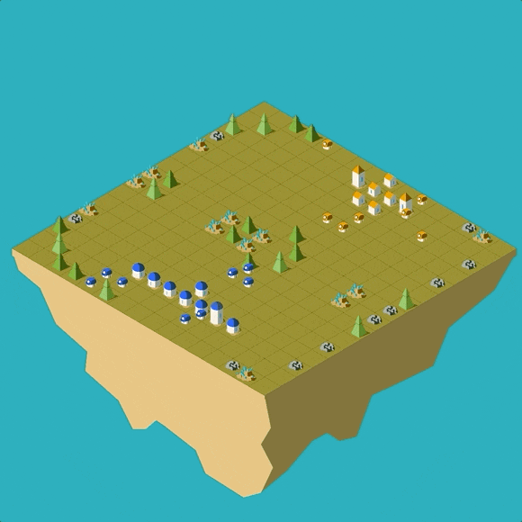

# Lux AI Challenge: Season 1

The night is dark and full of terrors. Two teams must fight off the darkness, collect resources, and advance through the ages. Daytime finds a desperate rush to gather and build the resources that can carry you through the impending night. Plan and expand carefully -- any city that fails to produce enough light will be consumed by darkness.

Welcome to the Lux AI Challenge Season 1!



The Lux AI Challenge is a competition where competitors design agents to tackle a multi-variable optimization, resource gathering, and allocation problem in a 1v1 scenario against other competitors. In addition to optimization, successful agents must be capable of analyzing their opponents and developing appropriate policies to get the upper hand.

Thanks to our sponsors [QuantCo](https://quantco.com/), [J Ventures](http://www.thejiangmen.com/), and [QAImera](https://qaimera.com), we have a $10,000 prize pool along with many other non-monetary prizes this year! For more information see https://www.lux-ai.org/sponsors-2021

Make sure to join our community discord at https://discord.gg/aWJt3UAcgn to chat, strategize, and learn with other competitors! We will be posting announcements on the Kaggle Forums and on the discord.

This was built by the Lux AI Challenge team, using the [Dimensions](https://github.com/StoneT2000/Dimensions) package.

To get started, go to our [Getting Started](#getting-started) section.

Season 1 specifications can be found here: https://lux-ai.org/specs-2021. These detail how the game works and what rules your agent must abide by.

Bot API Documentation: https://github.com/Lux-AI-Challenge/Lux-Design-2021/tree/master/kits.

Competition Leaderboard: Not yet released

The visualizer for the competition is at https://2021vis.lux-ai.org/. To get a local copy of the visualizer, see https://github.com/Lux-AI-Challenge/LuxViewer2021. You may also use the embedded visualizer on the Kaggle competition page or in jupyter notebooks.

## Getting Started

You will need Node.js version 12 or above. See installation instructions [here](https://nodejs.org/en/download/), you can just download the recommended version.

The next parts detail the recommended setup to develop and compete your bot. For users who wish to use Python and Jupyter Notebooks / Kaggle Interactive Notebooks, feel free to skip this section and follow the [tutorial notebook](https://www.kaggle.com/stonet2000/lux-ai-season-1-jupyter-notebook-tutorial)

Open up the command line, and install the competition design with

```
npm install -g @lux-ai/2021-challenge@latest
```

You may ignore any warnings that show up, those are harmless. To run a match from the command line (CLI), simply run

```
lux-ai-2021 path/to/botfile path/to/otherbotfile
```

and the match will run with some logging and store error logs and a replay in a new `errorlogs` folder and `replays` folder. Logs stored in the errorlogs will include all error output and anything printed to standard error by your agent. You can watch the replay stored in the replays folder using our [visualizer](https://2021vis.lux-ai.org/).

For a full list of commands from the CLI, run

```
lux-ai-2021 --help
```

or go to the [next section](#CLI-Usage) to see more instructions on how to use the command line tool, including generating stateful replays and running local leaderboards for evaluation. You may also run this all in docker using the `cli.sh` file in this repo, see instructions [here](#cli-docker).

The [kits](https://github.com/Lux-AI-Challenge/Lux-Design-2021/tree/master/kits) folder in this repository holds all of the available starter kits you can use to start competing and building an AI agent and show you how to get started with your language of choice and run a match with that bot. You can also follow the following direct links

- Python: https://github.com/Lux-AI-Challenge/Lux-Design-2021/tree/master/kits/python
- Javascript: https://github.com/Lux-AI-Challenge/Lux-Design-2021/tree/master/kits/js
- C++: https://github.com/Lux-AI-Challenge/Lux-Design-2021/tree/master/kits/cpp
- Java: https://github.com/Lux-AI-Challenge/Lux-Design-2021/tree/master/kits/java
- Typescript: https://github.com/Lux-AI-Challenge/Lux-Design-2021/tree/master/kits/ts

Want to use another language but it's not supported? Feel free to suggest that language to our issues or even better, create a starter kit for the community to use and make a PR to this repository. See our [CONTRIBUTING.md document](https://github.com/Lux-AI-Challenge/Lux-Design-2021/blob/master/CONTRIBUTING.md) for more information on this.

To stay up to date on changes and updates to the competition and the engine, watch for announcements on the [forums](https://www.kaggle.com/c/hungry-geese/discussion) or the [Discord](https://discord.com/invite/DZSm47VHMz). See https://github.com/Lux-AI-Challenge/Lux-Design-2021/blob/master/ChangeLog.md for a full change log.

## CLI Usage


### CLI General 
The CLI tool has several options. For example, one option is the seed and to set a seed of 100 simply run

```
lux-ai-2021 --seed=100 path/to/botfile path/to/otherbotfile
```

which will run a match using seed 100.

You can tell the CLI tool whether to store the agent logs or match replays via `--storeLogs, --storeReplay`. Set these boolean options like so

```
# to set to true
lux-ai-2021 --statefulReplay
# to set to false
lux-ai-2021 --storeLogs=false
```

By default the tool will generate minimum, **action-based**, replays that are small in size and work in the visualizer but it does not have state information e.g. resources on the map in each turn. To generate **stateful** replays, set the `--statefulReplay` option to true. To convert a action-based replay to a stateful one, set the `--convertToStateful` option to true and pass the file to convert.

Choose where the replay file is stored at by setting `--out=path/to/file.json`

You can also change the logging levels by setting `--loglevel=x` for number x from 0 to 4. The default is 2 which will print to terminal all game warnings and errors.

### CLI Leaderboard Evaluation

You can run your own local leaderboard / tournament to evaluate several bots at once via

```
lux-ai-2021 --rankSystem="trueskill" --tournament path/to/agent1 path/to/agent2 path/to/agent3 path/to/agent4 ...
```

This will run a leaderboard ranked by trueskill. Agents are auto matched with opponents with similar ratings. Recommended to add `--storeReplay=false --storeLogs=false` as letting this run for a long time will generate a lot of replays and log files.

See `lux-ai-2021` for more options.

### CLI Docker

This tool matches the lux-ai-2021 exactly, but runs on Ubuntu 18.04, the target system that the competition servers use. Make sure to first [install docker](https://docs.docker.com/get-docker/)

To then use the lux-ai-2021 CLI tool, simply call `bash cli.sh` and it will accept the same exact arguments. On the first run, it will build a docker image and run a container in the background. Future runs will then be much faster. Moreover, this uses a bind mount, so you can edit files locally on your computer and they will be reflected in the docker container and vice versa. 

The only caveat of this tool is that it has no access to files in directories above the current working directory (the output of the `pwd` command).

Moreover, this tool will not inherit the same installed python packages on your computer. To add packages, please download the Dockerfile from this repo into the same directory as the `cli.sh` file and add installation commands like so to the bottom of the file

```docker
RUN pip3 install <package_name>
```

After changing the Dockerfile, run `bash cli.sh clean` to clean the old docker stuff and then use `cli.sh` as usual.

## Contributing

See the [guide on contributing](https://github.com/Lux-AI-Challenge/Lux-Design-2021/tree/master/CONTRIBUTING.md)

## Authors

Original design for season 1 concevied by [Bovard](https://github.com/bovard) and [Stone](https://github.com/StoneT2000)

UI/UX Design by [Isa](https://github.com/p-isa)

With balance testing help from [David](https://github.com/holypegasus)

## Sponsors
We would like to thank our 3 sponsors, [QuantCo](https://quantco.com/), [J Ventures](http://www.thejiangmen.com/), and [QAImera](https://qaimera.com) this year for allowing us to provide a prize pool and exciting opportunities to our competitors! For more information on them, check them out here: https://www.lux-ai.org/sponsors-2021
